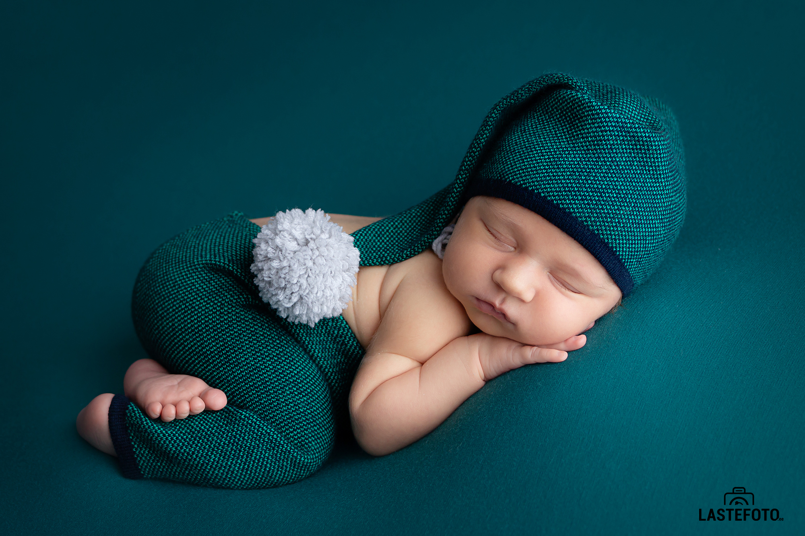

Rääkisin juba vastsündinu fotosessiooni kõige sobivamaks ajast, kõige armsatest poosidest... Ja täna tahan puudutada värvi teemat.

Enne fotosessiooni saavad vanemad minult küsimustiku, mille üheks punktiks on värvi valimine, milles fotosessioon toimub. Mul on umbes 15 värvi, mille hulgast saate valida.

